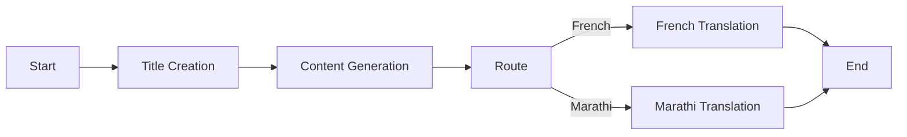

# End-to-End Blog Generation Agentic AI App

🚀 An **agentic AI-powered blog generation system** built with **LangChain, LangGraph, and Groq LLMs**.
This app generates **SEO-friendly blog titles, detailed blog content, and multilingual translations (French, Marathi, etc.)** using an agentic workflow defined via **LangGraph**.

---

## 📌 Features

* **Agentic Workflow with LangGraph** – Dynamically creates graphs for blog generation (topic-based or language-based).
* **SEO-Friendly Title Generation** – AI suggests optimized blog titles.
* **Content Generation** – Produces structured, detailed blog posts.
* **Multilingual Support** – Translate blogs into multiple languages (currently supports **French** & **Marathi**).
* **FastAPI Backend** – REST API to interact with the blog generator.
* **Groq LLM Integration** – Uses `langchain_groq.ChatGroq` with **LLaMA-based models** for fast inference.

---

## 🏗️ Project Structure

```
📦 end-to-end-blog-generation-agentic-ai-app
├── app.py                # FastAPI server with blog generation endpoint
├── main.py               # Entry point (prints hello for now)
├── src/
│   ├── graphs/
│   │   └── graph_builder.py   # Builds LangGraph workflows
│   ├── nodes/
│   │   └── blog_node.py       # Nodes for title, content, translation
│   ├── states/
│   │   └── blogstate.py       # TypedDict + Pydantic schema for blog state
│   ├── llms/
│   │   └── groqllm.py         # Groq LLM wrapper with fallback handling
├── langgraph.json        # LangGraph Studio config
├── pyproject.toml        # Poetry project config
├── requirements.txt      # Python dependencies
├── request.json          # Sample API request payloads
```

---

## ⚙️ Installation

### 1️⃣ Clone Repository

```bash
git clone https://github.com/KartikNimhan/End-to-End-Blog-Generation-Agentic-AI-App.git
cd End-to-End-Blog-Generation-Agentic-AI-App
```

### 2️⃣ Create Virtual Environment

```bash
python -m venv venv
source venv/bin/activate   # On Linux/Mac
venv\Scripts\activate      # On Windows
```

### 3️⃣ Install Dependencies

Using **pip**:

```bash
pip install -r requirements.txt
```

Or with **Poetry**:

```bash
poetry install
```

---

## 🔑 Environment Variables

Create a `.env` file in the project root with:

```env
GROQ_API_KEY=your_groq_api_key
LANGSMITH_API_KEY=your_langsmith_key
```

---

## 🚀 Running the App

### Start FastAPI Server

```bash
uvicorn app:app --host 0.0.0.0 --port 8000 --reload
```

### Test API (with `curl` or Postman)

**Generate Blog (Topic Only)**:

```bash
curl -X POST http://127.0.0.1:8000/blogs \
     -H "Content-Type: application/json" \
     -d '{"topic":"Agentic AI"}'
```

**Generate Blog in French**:

```bash
curl -X POST http://127.0.0.1:8000/blogs \
     -H "Content-Type: application/json" \
     -d '{"topic":"Agentic AI","language":"french"}'
```

---

## 📖 Example Request & Response

### Request (`request.json`)

```json
{
  "topic": "Agentic AI",
  "language": "french"
}
```

### Response

```json
{
  "data": {
    "blog": {
      "title": "L'intelligence Agentique : Réinventer l'IA moderne",
      "content": "## Introduction\nL'IA agentique transforme..."
    }
  }
}
```

---

## 🧩 LangGraph Studio Integration

This project includes `langgraph.json` for visualization/debugging with **LangGraph Studio**:

```json
{
  "dependencies": ["."],
  "graphs": {
    "blog_generation_agent": "./src/graphs/graph_builder.py:graph"
  },
  "env": "./.env"
}
```

---

## 🖼️ Workflow Diagram

### Mermaid (renders on GitHub)



### PNG Fallback (for docs/PDFs)


---

## 📌 Roadmap

* [ ] Add support for more languages
* [ ] Deploy as a hosted API service
* [ ] Add frontend UI for blog generation
* [ ] Improve SEO optimization

---

## 🤝 Contributing

Pull requests are welcome! Please open an issue first to discuss changes.

---

## 📜 License

MIT License © 2025


